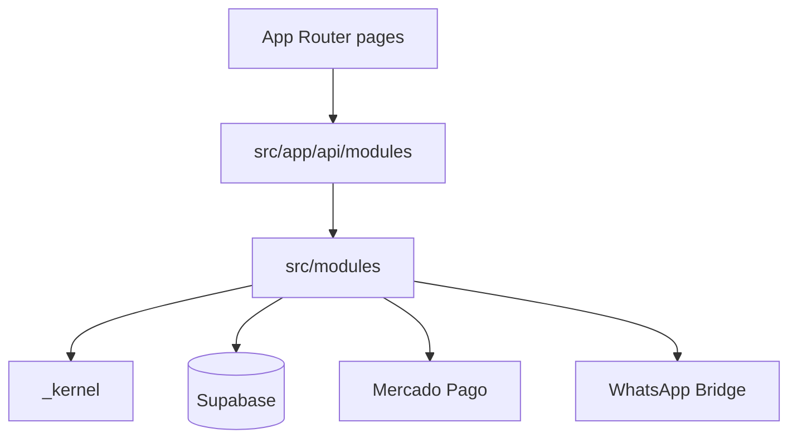

# Arquitectura RentNow (módulo docs-dev)

## Capas

## Módulos y contratos

| ID | Carpeta | Contrato |
|----|---------|----------|
| 1 | auth-enterprise | `IAuthEnterpriseService` |
| 2 | payments-mp | `IPaymentsMpService` |
| 3 | subscriptions-saas | `ISubscriptionsSaasService` |

## Variables por entorno

Ver `ENVIRONMENTS.md` en este mismo directorio.
